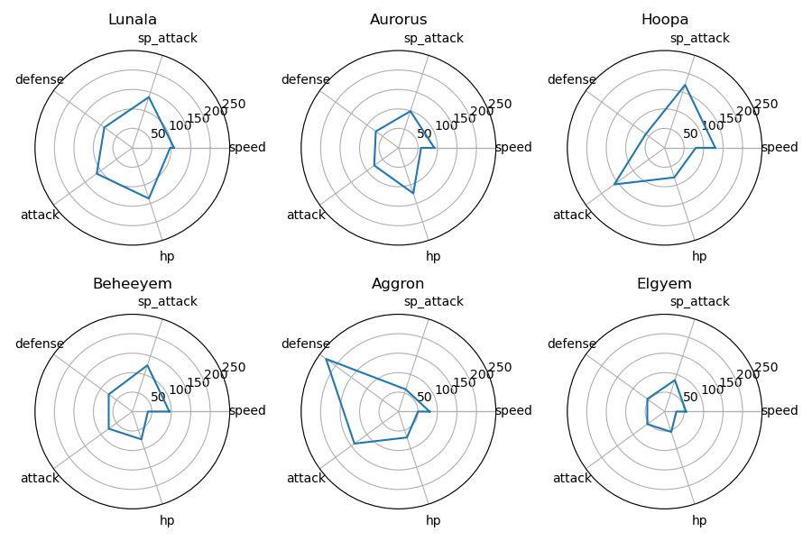

# SDM371 Big Data Lab Report Week 2 Q1

> By HUANG Guanchao, SID 11912309, from the School of Microelectronics.

## Goal

Select a group of 6 pokemon, by a specific metric.

## Algorithm Design

Sort the pokemon dataset by the resistivity against a given category, if the pokemon appears at the top 6 position, increase its `point` attribute by `1`, then choose the  pokemon with the highest `point`. Namely, we intend to choose the pokemon behaves most resistive to more categories of pokemon.

If more than 6 pokemon have the same `point`, then select the 6 with highest `hp` from them.

## Result

The choice is shown in the radar chart below.

## Evaluation

The 6 chosen pokemon all have `point` attribute equal to 2, which indicates that, they are among the most resistive pokemon against 2 categories. However, it is clear that, their other capabilities, specifically `defense`, `attack`, `hp`, `speed`, `sp_attack` and `sp_defense` vary a lot, and are not the best among all of the pokemon.

## Summary

In this lab experiment, we selected the pokemon with the most resistivity against different categories of pokemon. However, based on the single metric, it is obvious that we failed to find the most defensive group of pokemon. Taking a combination of multiple features into consideration is an possible amendment for our selection strategy.
