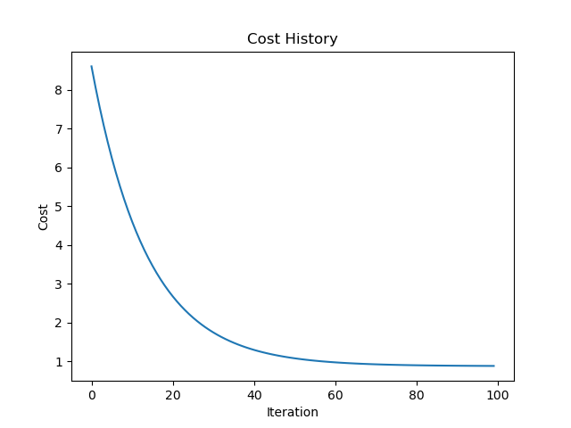
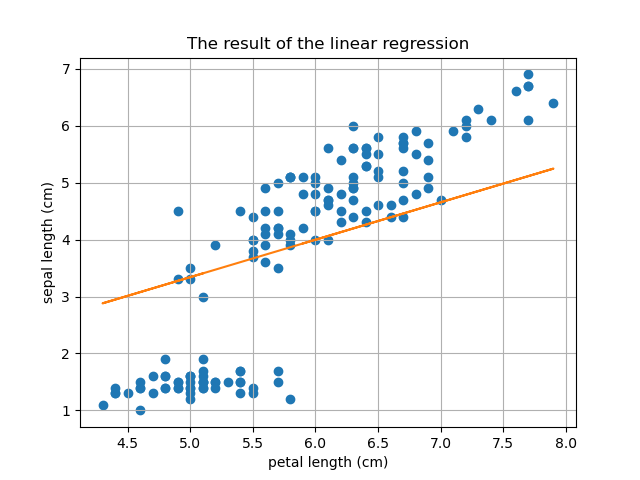
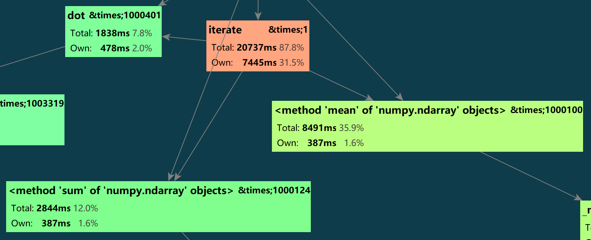

# SDM371 Big Data Lab Report Week 2 Q2

> By HUANG Guanchao, SID 11912309, from the School of Microelectronics.

## Goal

Program and train a linear regression model to quantify the relationship between petal length and sepal length.

## Algorithm Design

> The following deduction might contain some metathetical inconsistencies.

### Model Definition

Define the following notations.

|                  Variable                  | Notation  |
| :----------------------------------------: | :-------: |
|  A single training example (sepal length)  | $x^{(i)}$ |
|             The training batch             |    $X$    |
| A single ground truth label (petal length) | $y^{(i)}$ |
|           The ground truth batch           |    $Y$    |
|    The predicted result (petal length)     | $\hat{y}$ |
|          The size of the data set          |    $m$    |

Note that, in this implementation, we do not have separated dev and test set.

We may express the linear model as follows.

$$\hat{y} = \theta_1 x + \theta_0$$

Define the loss function as

$$\mathscr{L}\left(\hat{y}^{(i)}, y^{(i)}\right) =
\left(\hat{y}^{(i)} - y^{(i)}\right)^2$$

### Gradient Descent

The expression of the loss function could be further expanded as

$$\mathscr{L} = \left(\theta_1x^{(i)} + \theta_0 - y^{(i)}\right)^2.$$

Therefore, the derivative of the loss function with respect to the parameters is

$$\begin{aligned} &
    \frac{\partial L}{\partial\theta_1} =
    2\left(\theta_1x^{(i)} + \theta_0 - y^{(i)}\right)x^{(i)} =
    2(\hat{y} - y)x^{(i)} \\ &
    \frac{\partial L}{\partial\theta_0} =
    2\left(\theta_1x^{(i)} + \theta_0 - y^{(i)}\right) =
    2(\hat{y} - y)x^{(i)}
\end{aligned}$$

To apply update to the parameters with gradient descent, we have

$$\begin{aligned}
    \theta_1 := \theta_1 - \alpha\frac{\partial L}{\partial\theta_1} \\
    \theta_0 := \theta_0 - \alpha\frac{\partial L}{\partial\theta_0}
\end{aligned}$$

In which, $\alpha$ is the learning rate of the gradient descent. Our goal is to minimize $\mathscr{J}(\theta_1, \theta_0)$.

### Vectorization

In a vectorized view, the model can be re-expressed as

$$\hat{Y} = \theta_1X + \theta_0.$$

And the cost function is

$$\mathscr{J}(\theta_1, \theta_0) =
\frac{1}{2m}\sum_{i=1}^m
\mathscr{L}\left(\hat{y}^{(i)}, y^{(i)}\right).$$

And therefore, in a vectorized expression

$$J(\theta_1, \theta_0) =
\frac{1}{2m}\sum (\theta_1X + \theta_0 - Y)^2.$$

Similarly, for batch gradient descent, we have

$$\begin{aligned} &
    \theta_1 :=
    \theta_1 - \alpha\frac{\partial J}{\partial\theta_1} =
    \theta_1 - \frac{\alpha}{m}\left(\hat{Y} - Y\right)^TX  \\ &
    \theta_0 :=
    \theta_0 - \frac{\partial J}{\partial\theta_0} =
    \theta_0 - \frac{\alpha}{m}\sum^m\left(\hat{Y} - Y\right)
\end{aligned}$$

In which, $\left(\hat{Y} - Y\right)^TX$ denotes the inner product of the two vector, namely the sum of the element-wise product.

## Result

A vectorized version of linear regression with gradient descent is implemented. With a learning rate of `1e-3`, the model converges after about 100 iterations, the runtime is roughly 2ms.



The linear model roughly fitted the trend of the data.



## Evaluation

### Performance

Setting `num_iterations` to be `1_000_000`, the runtime is approximately 20 seconds.



According to the CProfiler snapshot, most of the runtime are spent in the `mean` method of `np.array`, which is abnormal. It is possible that, the `mean` method has some inefficiencies, and we can try replace the calculation of average with a summation divided by `m`.

The single line of code is change from

```python
d1, d0 = np.dot(distance, X) / m, distance.mean()
```

to

```python
d1, d0 = np.dot(distance, X) / m, distance.sum() / m
```

Now, the runtime is significantly reduced to only about 12 seconds. An educated guess is that, though `distance.mean()` and `distance.sum() / m` are equivalent in value, in calling the calculation of `mean()`, `NumPy` tries to obtain the length of the array, which is already known as `m`, and thus caused the waste of performance.

> Testing platform
>
> - Windows 10 Professional 21H1
> - PyCharm Professional 2021.2.2
> - Python 3.8.11
> - Ryzen 7 3800X, runs at 4.20 GHz
> - Glowy Abyss 32GB, dual-channel, runs at 3000MHz

### Bias Problem

It is clear that, the linear model failed to fit all of the data well, and the cost converges to about 1, instead of close to 0. The outliers with petal length under 5.75cm might be the cause of the bias problem. We can expect that, after removing these outliers, we may obtain a more accurate linear model for the rest of the data.

## Summary

- Vectorization could significantly improve the performance.
- A little bit of insight into and modification on the code can also improve the performance.
- Outliers may cause bias problem, try consider them separately.
