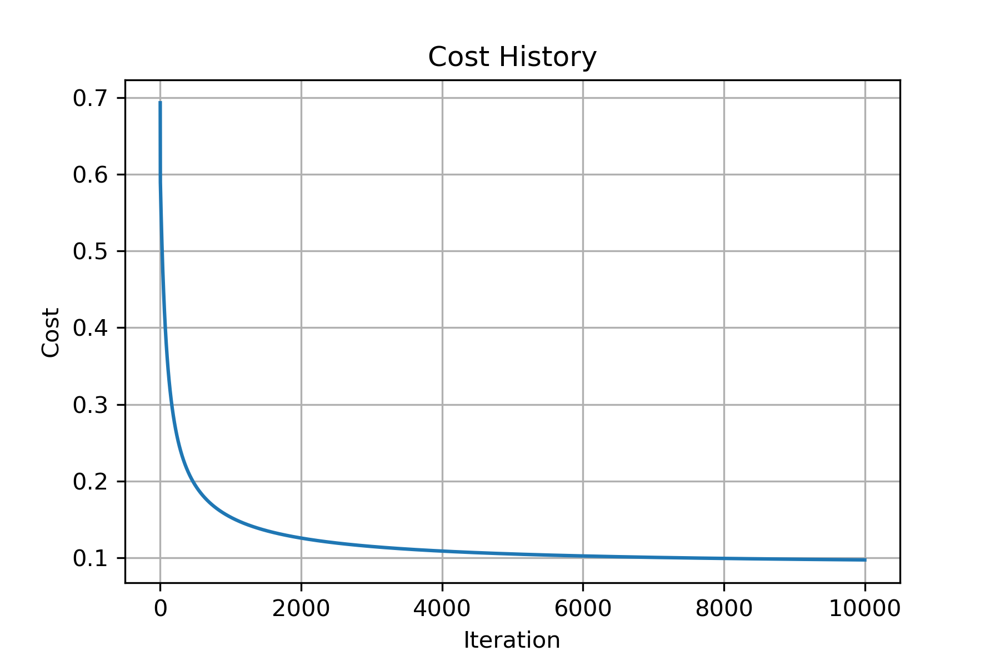
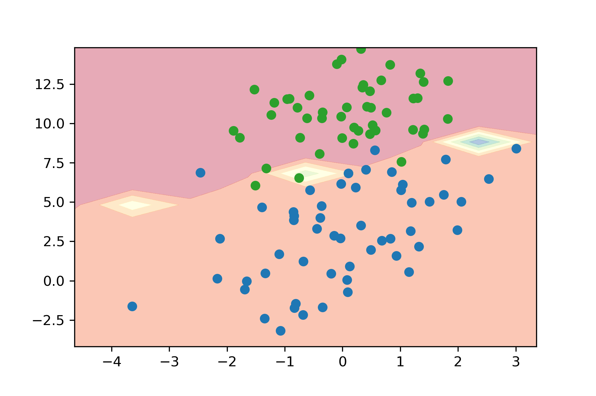

# SDM371 Big Data Lab 3 Report

> By HUANG Guanchao, SID 11912309, from the School of Microelectronics.

## Logistic Regression

The logistic regression hypothesis is defined as:
·
$$
h_\theta(x) = g\left(\theta^Tx\right),
$$

where function $g$ is the sigmoid function. The sigmoid function is defined as:

$$
g(z) = \frac{1}{1 + e^{-z}}
$$

With the maximum likelihood estimation, in a logistic regression task, the cost function is defined as

$$
J(\theta) = \frac1m\sum_{i=1}^m \left[
-y^{(i)} \log h_\theta\left(x^{(i)}\right) -
\left(1 - y^{(i)}\right)
\log\left(1 - h_\theta\left(x^{(i)}\right)\right)\right]
$$

And the gradient of the cost is a vector of the same length as $\theta$ where the the $j$th element (for $j = 0,\,1,\dots,\,n$) is defined as follows:

$$
\frac{\partial J(\theta)}{\partial \theta_j} =
\frac1m \sum_{i=1}^m\left(
    h_\theta\left(x^{(i)}\right)-y^{(i)}
    \right)x_j^{(i)}
$$

Note that, while this gradient expression looks identical to the linear regression gradient, the formula is in fact different since linear and logistic regression have different definitions for $h_\theta(x)$.

For updating the parameters, we have

$$
\theta_j :=
\theta_j -\alpha\frac1m\sum_{i=1}^m\left(
    h_{\theta} \left(x^{(i)} \right)-y^{(i)}
    \right) x_j^{(i)}
$$

## Vectorization

A vectorized version of the hypothesis is

$$
\hat{Y} = g\left(X\theta\right)
$$

The vectorized cost function is

$$
J(\theta) =
-\frac1m\left[
    Y^T\log\hat{Y} + (1 - Y)^T\log\left(1 - \hat{Y}\right)
    \right]
$$

And the vectorized gradient is

$$
\frac{\partial J(\theta)}{\partial\theta} =
\frac1m X^T\left(\hat{Y} - Y\right)
$$

And the parameters updating can be vectorized as

$$
\theta :=
\theta - \alpha\frac1m X^T\left(\hat{Y} - Y\right)
$$

---

## Training

Note that, we add an extra column vector of ones to of the features as $x_0$, and therefore we have 3 parameter, with $\theta_0$ functioning as bias.

---

## Results

At a learning rate of 0.1, the cost history in the 10,000 iterations is shown below.

Verifying the result, the difference between $Y$ and $\hat{Y}$ is roughly 0, our model does decently well on fitting the training set.

Another observation is that, as the training process proceeds, the cost converges to about 0.1 instead of 0, however, we can still make accurate prediction. That is because in logistic regression, some error from 0 or 1 will not affect the True/False decision.

We may also draw the data points and the decision boundary.

---

## Conclusion

- Our logistic regression model fits the training set well.
- With vectorization, our code is clean and simple and the performance is greatly enhanced.
- Though the expression for logistic regression looks identical with that of linear regression, but they are intrinsically different, since in logistic regression, we add an extra activate function *sigmoid*.
- In training logistic regression model, the cost cannot converge to perfectly 0, but we can still reach very hight accuracy, since logistic regression tasks only ask the model to predict 1 or 0.
