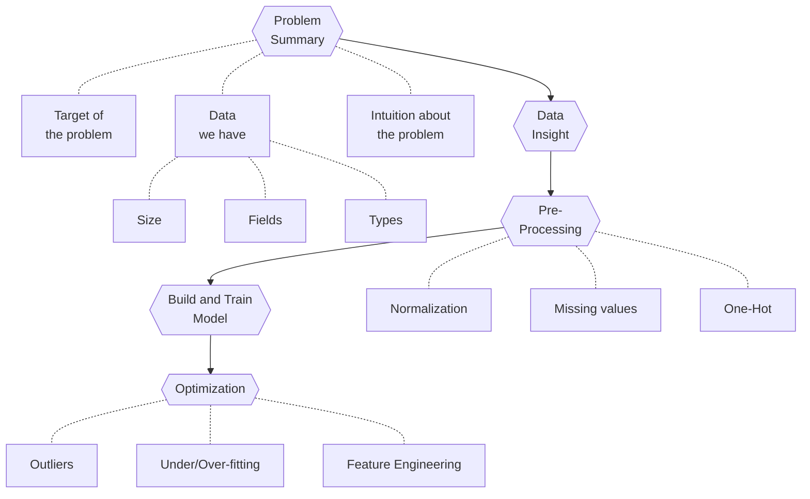

# SDM371 Big Data Lab 5 Report

> By HUANG Guanchao, SID 11912309, from the School of Microelectronics.

In this report, we will discuss the basic workflow of a data analysis problem, take "Titanic" problem Kaggle contest for an example.

[toc]

## Fetching Summary of the Problem

When we first get hands on the problem, we need to take a general glance at it to fetch some important summary. That includes the following

- The target of the problem
  - If it is an optimization problem, what is the optimization goal?
  - If it is an modeling problem, what is the model we are supposed to build? What are the inputs and outputs?
- The data we have
  - What is the size of the data?
  - How many fields are in it?
  - What are the fields? Are they discrete of continuous? Are they categorical?
- Intuition about the problem
  - What features might be influential in the problem?
  - Is the model a strong function of those features or weak? Positively related or negatively?

Once we had these summary information, we may search for others similar work before to find some inspirations.

## A Closer Look into the Data

Then, we may take a closer look into the data we have. Data processing packages such as `Pandas` provides a variety of data summarization tools.

For example, we may run `df.info()` to obtain the columns, not-null counts and their data types, which gives us hint about the integrity of the data.

Further more, we may use `df.describe()` to let `Pandas` describe the data briefly to us automatically, including mean, standard deviation, minimum and maximum, percentile numbers, etc. This gives us a big picture of the data, for example, specifically in the Titanic problem, how many people survived, the average age, people in 2nd or 3rd class cabin are more than those in 1st cabin, etc.

A statistical view on the data is not straightforward enough for us to inspect the patterns behind it. We may use data visualization packages, such as `seaborn`, `matplotlib`, as well as built-in tools in `Pandas` itself to visualize the data for us.

With the insights into the data, we may now propose some possible factors affecting the modeling object. Again, in the specific case of Titanic problem, we may suggest the following educated guess based on our analysis:

- Survival rate is related to cabin?
- Survival rate is related to age and gender?
- Survival rate is related to the onboarding port, which might indicates wealth and status?
- Survival rate is related to...

Once we propose such hypothesis, before proceed to modeling procedure, we need to validate that the relevance indeed exists, again using data visualization.

> Note that, some data processing/inspection tools provides data inspections powered by AI technology. For example, in Microsoft Excel, some "insights" can be made by the software automatically.

## Data Pre-Processing

Through the several steps before, we already have some important information as well as intuitions about the problem, especially those fields we want to pay attention to. Before we proceed to build and train the model, we need to pre-process these data, otherwise the model can not be implemented or cannot converge in the training process.

### Missing Values

In case the data is incomplete, we may need to deal withe the missing values. The strategy we apply depends on the type of the field and the percentage of the missing values.

- If the missing values accounts for a large proportion for a field, we should abandon this field, namely ignore this field in building models. Otherwise, if such fields are included in the model as features, noise is introduced to affect the result.
- In case that the missing values are not too many:
  - If this field is a discrete property, such as categorical type, we may add NaN as a new category into the data.
  - If this field is a continuous property, we may consider defining a step to sample the data, that is, to discretize the data into several categories, then add NaN as a category into it.
- In some cases, there are only a few values are missing. For continuous data, we can simply use data fitting to fill in these values.

### Normalization

Data normalization will not hurt the performance of the model, and is crucial in some cases. In case that a the range of a certain field is too large, or the ranges of several fields vary too much, we need to normalize the data to a specific range, for example, 0 to 1.

The normalization process must be done simultaneously and identically to the train and dev/test set. Some packages, such as `scikit-learn` can help with data preprocessing.

> Note that, in some cases, normalization would lead to the loss of granularity. In such case, we need to consider the trade-off.

### One-Hot Encoding

In most of the models taking categorical type as either input or output, one-hot expression is required. That is, we need to encode a category into a vector of all zeros but a one with its index indicating the category.

## Building the Model and Training

Once we've finished all steps above, we can choose the features we are interested in, and fit them into some regression models, provided by packages such as `scikit-learn`. Then, train the model on the training set, obtain the optimized model weights, and use which to predict the data in dev/test set, then compare with the ground truth.

We may fine tune the hyper-parameters of the model to achieve better performance in dev/test set.

## Optimizing the Model

With the model we've previously built, we may now consider some further optimizations to it.

First, we need to make sure that our model is neither under-fitting nor over-fitting the training set. This can be done by compare the learning curve (or error rate, accuracy, loss, etc.) on the training and dev/test set.

- If under-fitting occurs, we may consider adding more features into the model, or simply train the model with more iterations.
- If over-fitting occurs, we may remove some features from the model, or use tools such as dropout, regularization to prevent over-fitting.

Next, we can observe the features with high weights, and consider whether such high weights are valid or not.

In addition to this, we can observe the "bad cases" predicted incorrectly by the model in the dev/test set, find the pattern behind, and optimize the model correspondingly. For example, we might consider combine several features to form a new feature and add which into the model for better prediction.

## The Complete Workflow

The complete workflow of a data analysis problem, like the Titanic problem presented, can be summarized in the chart below.

